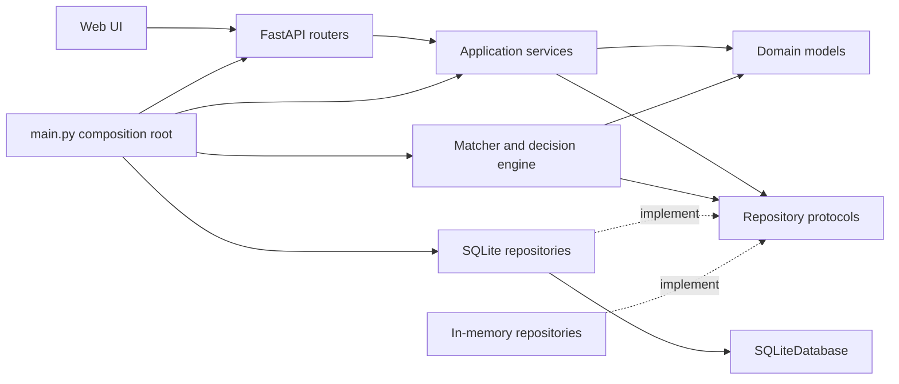
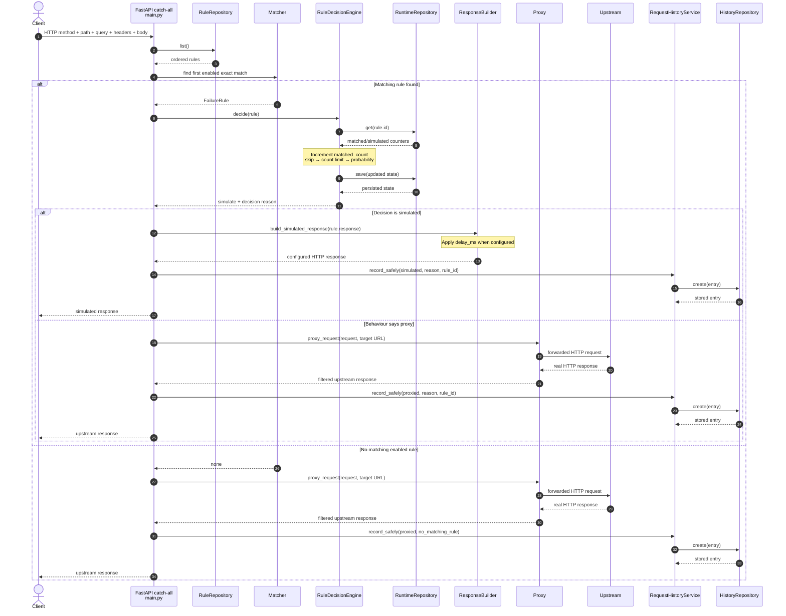
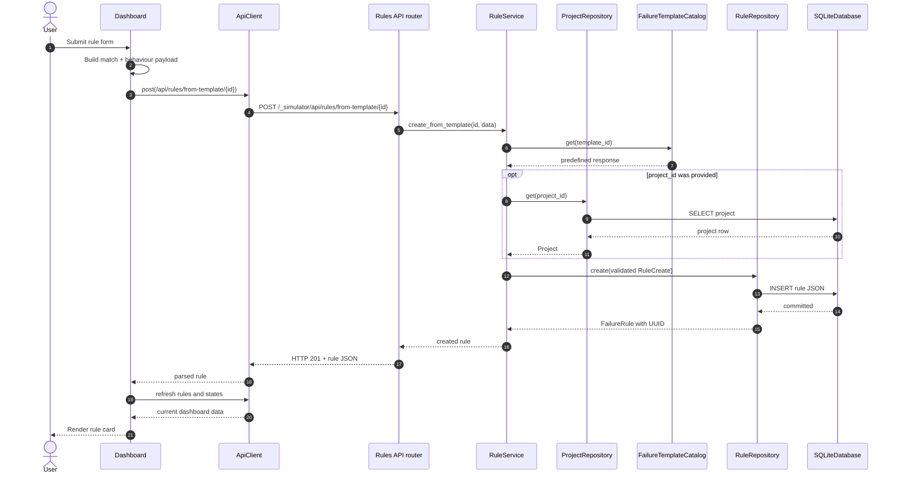

# Application architecture and sequence diagrams

## System boundary

Failure Simulation Tool combines two planes in one FastAPI application:

- the **control plane** under `/_simulator/*` manages projects, rules,
  templates, counters, history, and the web UI;
- the **data plane** receives every other HTTP request, decides whether to
  simulate a response, and otherwise proxies the request to the configured
  upstream API.

```text
Browser / API client
        |
        +-- /_simulator/* --> control plane
        |
        +-- all other paths --> matcher --> decision engine
                                          |          |
                                          |          +--> upstream
                                          +--> simulated response
```

`app/main.py` is the composition root. It creates concrete repositories and
services, connects their dependencies, registers HTTP routes, and owns the
catch-all data-plane request flow.

## Directory structure and responsibilities

```text
failure-simulation-tool/
├── app/
│   ├── api/                    # thin control-plane HTTP adapters
│   ├── core/                   # matching, decisions, proxying, responses
│   ├── models/                 # validated domain and API models
│   ├── services/               # management use-case orchestration
│   ├── web/                    # browser dashboard
│   ├── main.py                 # composition root and data-plane entry point
│   ├── database.py             # SQLite schema, initialization, migrations
│   ├── repository.py           # rule repository interface + implementations
│   ├── project_repository.py   # project repository interface + implementations
│   ├── runtime_repository.py   # rule-counter repository + implementations
│   ├── history_repository.py   # history repository interface + implementations
│   ├── templates.py            # predefined failure catalogue
│   ├── config.py               # environment-backed runtime settings
│   └── constants.py            # shared routing constants
├── docs/                       # product and technical documentation
├── scripts/demo.py             # dependency-free management/data-plane demo
├── tests/                      # unit and integration tests
├── Dockerfile                  # production-like application image
└── docker-compose.yml          # simulator + disposable upstream demo
```

### `app/main.py`

This module wires the application together:

- reads `Settings`;
- creates SQLite repositories for normal startup or in-memory repositories
  when dependencies are injected by tests;
- creates `ProjectService`, `RuleService`, `RequestHistoryService`, and
  `RuleDecisionEngine`;
- mounts the UI and control-plane routers at `/_simulator`;
- processes all data-plane traffic in `simulate_or_proxy`;
- owns the reusable HTTPX client and converts upstream connection failures into
  a `502` response.

The created objects are kept in `application.state`. HTTP adapters retrieve
their service from that state instead of constructing dependencies themselves.

### `app/api/`

These modules are FastAPI adapters for the control plane:

- `projects.py` exposes project CRUD operations;
- `rules.py` exposes rule CRUD, enable/disable, runtime states, reset, and
  template-based creation;
- `templates.py` exposes the read-only predefined failure catalogue;
- `history.py` returns recent request decisions.

Routers validate transport input through Pydantic, call an application service
or catalogue, and translate results into HTTP status codes. Business decisions
do not belong in the routers.

### `app/services/`

Services implement management use cases:

- `ProjectService` prevents deletion of a project that still contains rules;
- `RuleService` validates project references, creates rules from templates,
  changes enabled state, deletes rules, lists counter states, and resets them;
- `RequestHistoryService` creates history entries and offers `record_safely`,
  ensuring a history-storage error does not break the proxied client request.

Services depend on repository protocols, not on SQLite classes. This keeps the
business layer testable and allows another storage implementation later.

### `app/core/`

The core modules handle data-plane behaviour:

- `matcher.py` selects the first enabled rule with an exact method and path;
- `decision.py` contains the OOP behaviour engine and its independent policies:
  `SkipMatchesPolicy`, `CountLimitPolicy`, and `ProbabilityPolicy`;
- `response.py` applies an optional delay and builds the configured simulated
  response;
- `proxy.py` builds the upstream URL, removes unsafe hop-by-hop headers,
  forwards method/query/body/headers, and maps the upstream response back to
  the client.

`RuleDecisionEngine` coordinates policies and persistent runtime state. The
policies decide *whether* a matched rule triggers; they do not know about
FastAPI, SQLite, or the upstream client.

### `app/models/`

Pydantic models define and validate the domain contract:

- `project.py`: `Project` and `ProjectCreate`;
- `rule.py`: exact request match, simulated response, rule create/update data,
  and stored failure rule;
- `behavior.py`: probability/count configuration, runtime counters, and
  decision-reason enum;
- `template.py`: predefined template and template-based rule request;
- `history.py`: request outcome and persisted history entry.

Validation is performed before invalid configuration can reach a repository.
This includes reserved control paths, HTTP status/delay limits, safe headers,
JSON-compatible body limits, and behaviour ranges.

### Repositories and `app/database.py`

Each storage concern has a protocol and two implementations:

| Concern | Protocol module | Production implementation | Test implementation |
| --- | --- | --- | --- |
| Rules | `repository.py` | `SQLiteRuleRepository` | `InMemoryRuleRepository` |
| Projects | `project_repository.py` | `SQLiteProjectRepository` | `InMemoryProjectRepository` |
| Counters | `runtime_repository.py` | `SQLiteRuleRuntimeRepository` | `InMemoryRuleRuntimeRepository` |
| History | `history_repository.py` | `SQLiteRequestHistoryRepository` | `InMemoryRequestHistoryRepository` |

`SQLiteDatabase` owns connection creation, transactions, schema initialization,
initial seed data, and compatible schema migrations. Project and rule
configuration is serialized as validated JSON. Runtime counters and request
history use dedicated columns for efficient updates and ordering.

### `app/web/`

The UI is deliberately dependency-free:

- `index.html` defines the dashboard and forms;
- `static/app.js` contains `ApiClient` and `Dashboard` classes;
- `static/styles.css` owns presentation and responsive layout.

`ApiClient` distinguishes control-plane calls, which receive the
`/_simulator` prefix, from `send()`, which deliberately sends a raw data-plane
request to the rule path.

## Dependency direction



The outer composition root chooses implementations. Core policies and services
work against abstractions, which is the main OOP boundary in the application.

## Sequence: simulated or proxied request

This diagram describes a request to any path outside `/_simulator/*`.



If the upstream connection fails, `main.py` returns `502`, records the request
as `proxied`, and keeps the applicable decision reason.

## Sequence: create a rule from a template

This diagram follows the web UI action, but the same API can be called directly
with `curl` or another client.



## Current architectural constraints

- Matching is exact by method and path; query/body/header matching is not yet
  part of rule selection.
- The first enabled matching rule owns the decision. A probability miss does
  not fall through to another rule.
- One simulator instance has one global `TARGET_API_URL`; projects currently
  organize rules but do not select different upstreams.
- Counter updates are serialized inside one process. Multiple Uvicorn workers
  or replicas need a stronger cross-process atomic update mechanism.
- History persistence is best-effort so an observability failure does not
  replace the intended simulated or upstream response.
